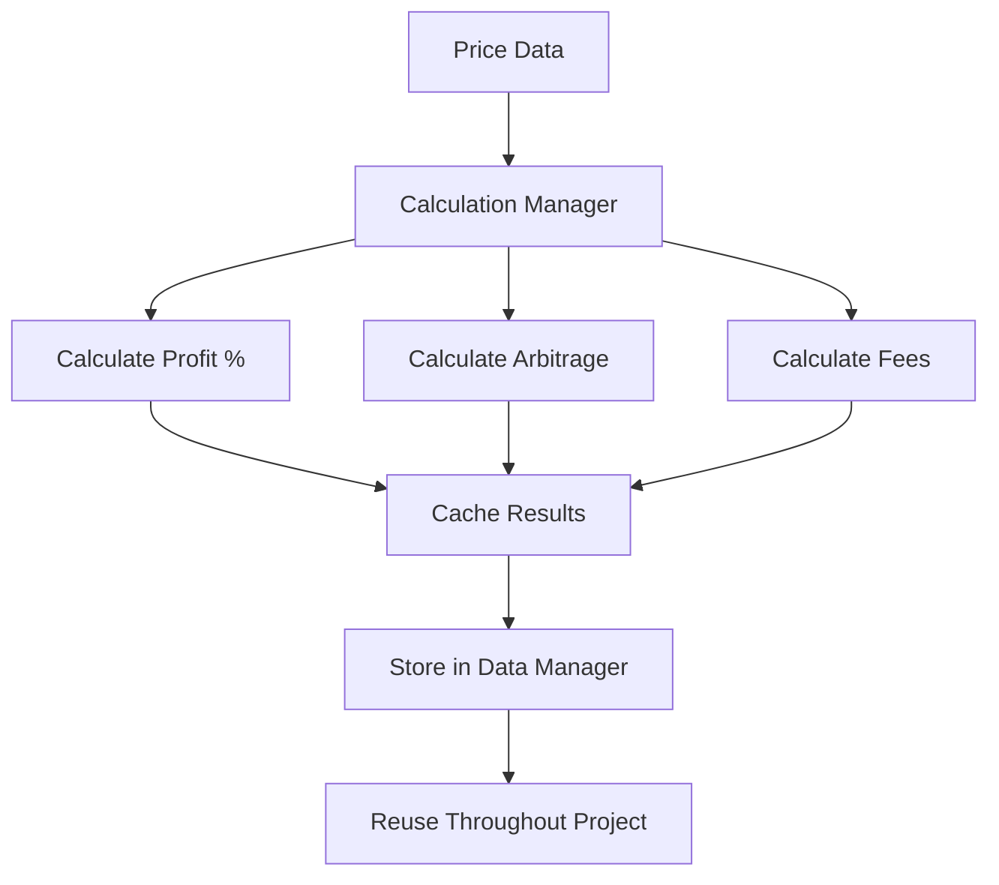
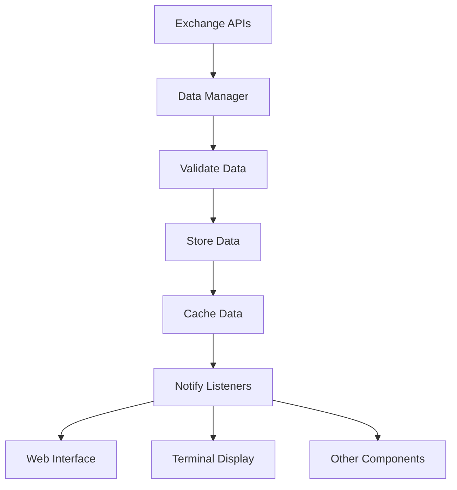

# Centralized Calculation and Data Management System

## Overview

This system implements a centralized approach to calculations and data management throughout the multi-currency arbitrage project. All calculations are performed once and stored centrally, making them reusable across the entire project.

## Key Components

### 1. Calculation Manager (`src/Arbitrage Logic/utils/calculationManager.js`)

**Purpose**: Centralizes all mathematical calculations in one place.

**Features**:
- ✅ **Single Source of Truth**: All calculations performed here
- ✅ **Caching**: Results cached for performance optimization
- ✅ **Reusable Functions**: All calculation functions exported for use anywhere
- ✅ **Error Handling**: Comprehensive validation and error handling
- ✅ **Statistics**: Performance monitoring and statistics

**Key Functions**:
```javascript
// Profit calculations
calculateProfitPercentage(buyPrice, sellPrice)
calculatePriceDifference(buyPrice, sellPrice)
calculateProfitLossPercentage(costPrice, sellingPrice)

// Arbitrage calculations
calculateArbitrageOpportunity(exchangeA, exchangeB, config)
calculateAllArbitrageOpportunities(prices, config)

// Fee and cost calculations
calculateTotalCost(basePrice, feePercentage, fixedCost)
calculateNetProfit(grossProfit, buyFee, sellFee, tradeAmount)

// Volume and risk calculations
calculateTradeVolume(config, price)
calculateRiskMetrics(opportunities, config)
```

### 2. Data Manager (`src/Arbitrage Logic/core/dataManager.js`)

**Purpose**: Centralizes all data storage and retrieval throughout the project.

**Features**:
- ✅ **Centralized Storage**: All data stored in one place
- ✅ **Data Validation**: Automatic validation of all stored data
- ✅ **Caching System**: Intelligent caching with TTL
- ✅ **Real-time Updates**: Listener system for data updates
- ✅ **Export/Import**: Data persistence and restoration
- ✅ **Statistics**: Performance monitoring

**Data Types Managed**:
```javascript
// Currency data
storeCurrencyData(currencyCode, data)
getCurrencyData(currencyCode)

// Exchange data
storeExchangeData(exchangeId, data)
getExchangeData(exchangeId)

// Opportunities
storeOpportunities(currencyCode, opportunities)
getOpportunities(currencyCode)

// Statistics
storeStatistics(key, stats)
getStatistics(key)

// Configuration
storeConfiguration(key, config)
getConfiguration(key)

// Caching
cacheData(key, data, ttl)
getCachedData(key)
```

## How It Works

### 1. Calculation Flow



### 2. Data Flow



## Benefits

### 1. **Performance Optimization**
- ✅ Calculations performed once, cached, and reused
- ✅ Reduced CPU usage and improved response times
- ✅ Intelligent caching with TTL (Time To Live)

### 2. **Data Consistency**
- ✅ Single source of truth for all data
- ✅ Automatic data validation
- ✅ Version tracking for data updates

### 3. **Code Reusability**
- ✅ All calculation functions available project-wide
- ✅ No duplicate calculation code
- ✅ Centralized error handling

### 4. **Maintainability**
- ✅ Easy to modify calculations in one place
- ✅ Clear separation of concerns
- ✅ Comprehensive logging and statistics

### 5. **Scalability**
- ✅ Easy to add new calculation types
- ✅ Easy to add new data types
- ✅ Performance monitoring built-in

## Usage Examples

### 1. Using Calculation Manager

```javascript
import { calculationManager } from './src/Arbitrage Logic/utils/index.js';

// Calculate profit percentage
const profit = calculationManager.calculateProfitPercentage(100, 102);
console.log(`Profit: ${profit}%`); // Output: Profit: 2.00%

// Calculate arbitrage opportunities
const opportunities = calculationManager.calculateArbitrageOpportunity(
    { ask: 100, bid: 99 },
    { ask: 101, bid: 102 },
    { profitThresholdPercent: 1.0 }
);
```

### 2. Using Data Manager

```javascript
import dataManager from './src/Arbitrage Logic/core/dataManager.js';

// Store currency data
dataManager.storeCurrencyData('AIOT', {
    prices: { mexc: { bid: 100, ask: 101 } },
    opportunities: [],
    enabledExchanges: ['mexc']
});

// Retrieve data
const aiotData = dataManager.getCurrencyData('AIOT');
console.log('AIOT Data:', aiotData);

// Cache data
dataManager.cacheData('price-cache', { price: 100 }, 60000);
const cachedPrice = dataManager.getCachedData('price-cache');
```

### 3. Integration with Multi-Currency System

```javascript
// In multiCurrencyManager.js
const opportunities = calculationManager.calculateAllArbitrageOpportunities(prices, config);

// Store results centrally
dataManager.storeCurrencyData(currencyCode, {
    prices,
    opportunities,
    enabledExchanges,
    config: {
        profitThreshold: config.profitThresholdPercent,
        tradeVolume: config.tradeVolumeUSD
    }
});

// Retrieve for web interface
const allData = dataManager.getAllCurrencyData();
webInterface.updateExchangeData({ currencies: allData });
```

## Configuration

### Calculation Manager Configuration

```javascript
// Cache settings
const cacheConfig = {
    maxSize: 10000,
    ttl: 60000, // 1 minute
    enableWarming: true
};

// Validation rules
const validationRules = {
    price: (value) => typeof value === 'number' && value > 0,
    percentage: (value) => typeof value === 'number' && value >= -100 && value <= 1000
};
```

### Data Manager Configuration

```javascript
// Data validation rules
const validationRules = {
    price: (value) => typeof value === 'number' && value > 0,
    percentage: (value) => typeof value === 'number' && value >= -100 && value <= 1000,
    timestamp: (value) => typeof value === 'number' && value > 0,
    string: (value) => typeof value === 'string' && value.length > 0
};

// Cache settings
const cacheConfig = {
    defaultTTL: 60000, // 1 minute
    maxCacheSize: 1000
};
```

## Testing

Run the centralized system test:

```bash
node test_centralized_system.js
```

This test demonstrates:
- ✅ All calculation functions working correctly
- ✅ Data storage and retrieval
- ✅ Caching system functionality
- ✅ Multi-currency configuration integration
- ✅ Performance statistics
- ✅ Data export/import functionality

## Statistics and Monitoring

### Calculation Manager Statistics

```javascript
const stats = calculationManager.getStatistics();
console.log(stats);
// Output:
// {
//   cacheSize: 15,
//   cacheStats: { size: 15, maxSize: 10000, utilization: 0.15 },
//   totalCalculations: 15
// }
```

### Data Manager Statistics

```javascript
const stats = dataManager.getManagerStatistics();
console.log(stats);
// Output:
// {
//   totalUpdates: 25,
//   cacheHits: 150,
//   cacheMisses: 25,
//   lastUpdate: 1755896806801,
//   currencyCount: 3,
//   exchangeCount: 4,
//   opportunityCount: 3,
//   cacheSize: 10,
//   listenerCount: 5
// }
```

## Error Handling

The system includes comprehensive error handling:

```javascript
// Validation errors
try {
    calculationManager.calculateProfitPercentage('invalid', 100);
} catch (error) {
    console.error('Validation error:', error.message);
    // Output: Validation error: Price parameters must be numbers
}

// Data validation
try {
    dataManager.storeCurrencyData('', {});
} catch (error) {
    console.error('Data error:', error.message);
    // Output: Data error: Invalid currency code
}
```

## Future Enhancements

1. **Database Integration**: Store data in persistent database
2. **Real-time Analytics**: Advanced analytics and reporting
3. **Machine Learning**: Predictive calculations and optimizations
4. **Distributed Caching**: Redis or similar for distributed systems
5. **API Endpoints**: REST API for external access to data

## Conclusion

This centralized system provides:

- ✅ **Single Source of Truth**: All calculations and data in one place
- ✅ **High Performance**: Caching and optimization
- ✅ **Easy Maintenance**: Clear structure and documentation
- ✅ **Scalability**: Easy to extend and modify
- ✅ **Reliability**: Comprehensive error handling and validation

The system ensures that all calculations are performed once and reused throughout the project, making it efficient, maintainable, and scalable.
